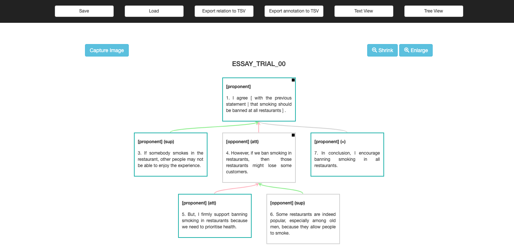

# TIARA v2.0: An Interactive Tool for Annotating Discourse Structure and Text Improvement

[](https://opensource.org/licenses/MIT)
[](https://semver.org)

Annotation tool described in [our paper at LREC2020](http://www.lrec-conf.org/proceedings/lrec2020/pdf/2020.lrec-1.854.pdf). Please kindly cite the following paper when you use this tool. **You can use this tool freely**, but it would be appreciated if you could send me a courtesy [email](https://wiragotama.github.io) so I could survey what kind of tasks the tool is used for. 


```
@inproceedings{putra-etal-2020-tiara,
    title = "{TIARA}: A Tool for Annotating Discourse Relations and Sentence Reordering",
    author = "Putra, Jan Wira Gotama  and
      Teufel, Simone  and
      Matsumura, Kana  and
      Tokunaga, Takenobu",
    booktitle = "Proceedings of The 12th Language Resources and Evaluation Conference",
    month = may,
    year = "2020",
    address = "Marseille, France",
    publisher = "European Language Resources Association",
    url = "https://www.aclweb.org/anthology/2020.lrec-1.854",
    pages = "6912--6920",
    language = "English",
    ISBN = "979-10-95546-34-4",
}
```

>Jan Wira Gotama Putra, Simone Teufel, Kana Matsumura, and Takenobu Tokunaga. TIARA: A Tool for Annotating Discourse Relations and Sentence Reordering. Proceedings of the 12th International Conference on Language Resources and Evaluation (LREC), pp. 6914--6922, Marseille, France, May 2020.

## How to Use
- Fork, clone or download (+unpack) this repository
- Read the manual located at ```manual/``` folder
- Open ```index.html``` located at the root folder using a web browser.
- We have confirmed that the tool works on Google Chrome (ver 88). You can use other web browsers at your own risk.
- Live demo: <https://wiragotama.github.io/TIARA-annotationTool/> (since this is a **client-side** tool, your data (essay) will not be uploaded, i.e., stays locally in your computer)

## Concept
There are many great annotation tools available out there. However, some (if not many) require complicated steps (and dependencies) to install. People with programming background may not find it difficult to install but people from other backgrounds may. This annotation tool considers the ease of use in mind (of course, with compromises), even for people without a programming background. That is why we provide this **client-side** annotation tool. The tool is customizable, by changing the conguration to suit your annotation scheme, as explained in the manual (configuration file: ```js/annotation-globalsetting.js```). 

We designed the tool to be general enough for discourse structure and argumentative structure annotation (but the structure must be tree-shaped). Specifically, it can be used to annotate sentence (discourse unit) categories and relations between sentences. This tool can also be useful for educational purpose as well. Please read our paper for a more complete explanation. 

## Formatting Text for Annotation
Format the text you want to annotate in ```.txt```, in which each discourse unit (sentence/clause) is separated by a newline. See at the following example (```sample_original/ESSAY_TRIAL_00.txt```).

```
I agree with the previous statement.
I have a two reasons.
If somebody smokes in the restaurant, other people may not be able to enjoy the experience.
However, if we ban smoking in restaurants, then those restaurants might lose some customers.
But, I firmly support banning smoking in restaurants because we need to prioritise health.
Some restaurants are indeed popular, especially among old men, because they allow people to smoke.
In conclusion, I encourage banning smoking in all restaurants.

``` 

## Educational Use Case
While the tool was originally developed as an annotation tool, it now offers various editing functions. We believe that these functions will enhance the learning experience, particularly in the teaching of argumentation. Please read our paper and manual on how to use TIARA for teaching.

## Important
- Refresh the web browser before working on another file (see the manual). <span style="color:gray"> While it should be generally safe without refreshing, we found super rare cases (when used by our annotator, and that we cannot reproduce) in which error happens when loading files into pre-existing workarea. </span>
- However, do not refresh the web browser midway (the annotation will be gone otherwise)
- If you are looking for the older version of TIARA, visit <https://github.com/wiragotama/TIARAv1> (without sentence categorization support)

## Update!!
Since we published the LREC paper above, we have made the following updates to the tool.

- ```2020/02/22```: The tool now support the annotation of sentence categories. The textarea of ```text view``` will adjust its size (useful for annotating long texts). You can also customize the colors for the sentence categories. 
- ```2021/01/21```: There is a new ```Add New Sentence``` button at the bottom of the ```text view```. This button is dedicated for educational uses. For example, a teacher asks a student to add more sentences to support their argument. Another example is when the teacher asks the student to merge two or more sentences as a single opinion. In this case, the student may "drop" those two or more sentences, and then create a new merged sentence. 
- ```2021/01/21```: You can now shrink and enlarge the hierarchical view
- ```2020/10/03```: TIARA can now open (visualise) ```.tsv``` file that results from ```Export annotation to TSV``` menu. Please note that the indentation and history do not present in the ```.tsv``` format. Update: issues found and fixed  in```2021/02/24```.

## License 
[MIT](https://opensource.org/licenses/MIT)

## Dependencies (included)
- [Treant-js](https://github.com/fperucic/treant-js) + [Raphael-js](https://dmitrybaranovskiy.github.io/raphael/)
- [JsPlumb](https://github.com/jsplumb/jsplumb)
- [html2canvas](https://github.com/niklasvh/html2canvas)
- [Autosize](https://github.com/jackmoore/autosize)

## Screenshots

