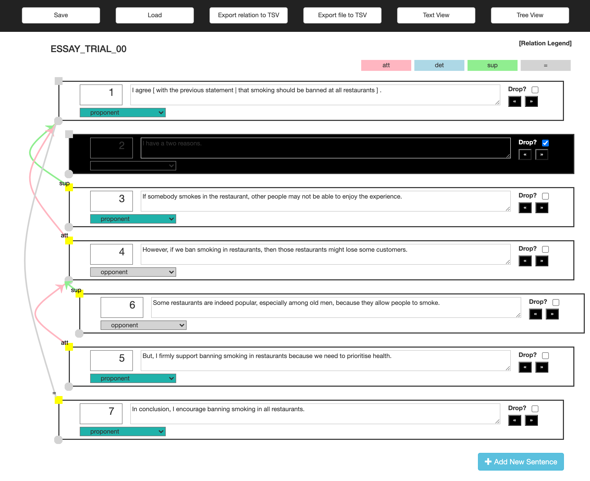

# TIARA - A Lightweight Tool for Annotating Discourse Relations and Sentence Reordering
Annotation tool described in [our paper at LREC2020](http://www.lrec-conf.org/proceedings/lrec2020/pdf/2020.lrec-1.854.pdf). Please kindly cite the following paper when you use this tool. It would also be appreciated if you send me a courtesy [email](https://wiragotama.github.io), so I could survey what kind of tasks the tool is used for. 

```
@inproceedings{putra-etal-2020-tiara,
    title = "{TIARA}: A Tool for Annotating Discourse Relations and Sentence Reordering",
    author = "Putra, Jan Wira Gotama  and
      Teufel, Simone  and
      Matsumura, Kana  and
      Tokunaga, Takenobu",
    booktitle = "Proceedings of The 12th Language Resources and Evaluation Conference",
    month = may,
    year = "2020",
    address = "Marseille, France",
    publisher = "European Language Resources Association",
    url = "https://www.aclweb.org/anthology/2020.lrec-1.854",
    pages = "6912--6920",
    language = "English",
    ISBN = "979-10-95546-34-4",
}
```

>Jan Wira Gotama Putra, Simone Teufel, Kana Matsumura, and Takenobu Tokunaga. TIARA: A Tool for Annotating Discourse Relations and Sentence Reordering. Proceedings of the 12th International Conference on Language Resources and Evaluation (LREC), pp. 6914--6922, Marseille, France, May 2020.

## How to Use
- Fork, clone or download (+unpack) this repository
- Read the manual located at ```manual/``` folder
- Open ```index.html``` located at the root folder using a web browser.
- We have confirmed that the tool works on Google Chrome (ver 7.4++). You can use other web browsers at your own risk.
- Live demo: <https://wiragotama.github.io/TIARA-annotationTool/> (since this is a **client-side** tool, your data (essay) will not be uploaded, i.e., stays in your computer locally)

## Concept
There are many great annotation tools available out there. However, some (if not many) require complicated steps (and dependencies) to install. People with programming background may not find it difficult to install but people from other backgrounds may. This annotation tool considers the ease of use in mind (of course, with compromises), even for people without a programming background. That is why we provide this **client-side** annotation tool. The tool is customizable, by changing the conguration to suit your annotation scheme, as explained in the manual (configuration file: ```js/annotation-globalsetting.js```). 

## Formatting Text for Annotation
Format the text you want to annotate in ```.txt```, in which each discourse unit (sentence/clause) is separated by a newline. See at the following example (```sample_original/ESSAY_TRIAL_00.txt```).

```
I agree with the previous statement.
If somebody smokes in the restaurant, other people may not be able to enjoy the experience.
At restaurants, customers enjoy eating and talking.
However, if we ban smoking in restaurants, then those restaurants might lose some customers.
Some restaurants are indeed popular, especially among old men, because they allow people to smoke.
But, I firmly support banning smoking in restaurants because we need to prioritise health.
In conclusion, I encourage banning smoking in all restaurants.

``` 

## Important
- Refresh the web browser before working on another file (see the manual). <span style="color:gray"> While it should be generally safe without refreshing, we found super rare cases (when used by our annotator, and that we cannot reproduce) in which error happens when loading files into pre-existing workarea. </span>
- However, do not refresh the web browser midway (the annotation will be gone otherwise)

## License 
[MIT](https://opensource.org/licenses/MIT)

## Dependencies (included)
- [Treant-js](https://github.com/fperucic/treant-js)
- [JsPlumb](https://github.com/jsplumb/jsplumb)
- [html2canvas](https://github.com/niklasvh/html2canvas)

## Screenshots

